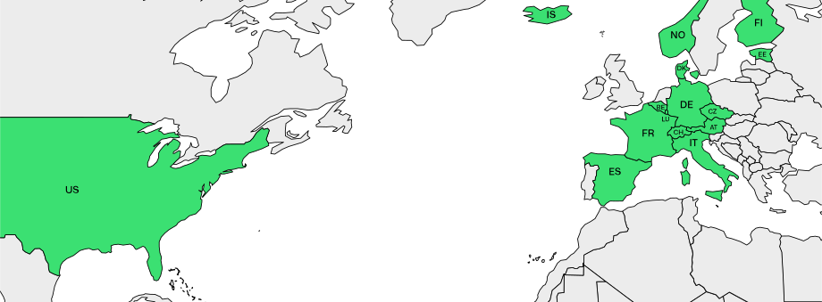

# Validate ZIP Codes with Regular Expressions

[](https://www.npmjs.com/package/val-zip)  [](https://openbase.com/js/val-zip?utm_source=embedded&utm_medium=badge&utm_campaign=rate-badge) [](https://www.jsdelivr.com/package/npm/val-zip)

A Library of JavaScript Regular Expressions for validating if a specific Zip-code exists in a specific Country.

Not every 5 digit number is automatically a zip code... As of now Regular Expression seem to be the fastest way of validating if a zip code actually exists. No slow backend validation needed, just some fancy RegExp.

So Why val-zip? Because it is free for commercial use and it is super fast and light weight with only 305kB size.



As of now the Regular Expressions for Germany, Austria, Switzerland, USA (5-Digit version), Belgium, Denmark, Czechia, Finland, Norway, Italy, Spain, Estonia, Iceland, France, Luxembourg are available with more coming asap.

## Usage

Download via Node Package Manager (NPM):

```shell
npm install val-zip
```

Import via Content Delivery Network (CDN):

```html
<script type="module" src="https://cdn.skypack.dev/val-zip@latest" corossorigin="anonymous" referrerpolicy="no-referrer"></script>
<script type="module" src="https://cdn.jsdelivr.net/npm/val-zip@latest/dist/val-zip.umd.js" crossorigin="anonymous" referrerpolicy="no-referrer"></script>
<script type="module" src="https://unpkg.com/val-zip@1.0.12/dist/va-zip.udm.js" crossorigin="anonymous" referrerpolicy="no-referrer"></script>
```

Note: CDN is still wip, so error may occur. In doubt use skypack cdn

## Example

```javascript
import valZip from "val-zip"; // make sure to use type="module" or ".mjs" file extension
// alternative: const valZip = require("val-zip"); 
// note: the require function is nodejs specific and is not available in a ESM or Browser environment.
// make sure to use type="commonjs" or the ".cjs" file extension

// let's say a random user puts in a zipcode somehow and you want to validate if the zip code exists.

var userCountry = "US"; //  ISO 3166 Country Code; string
var inputZip_1 = "12345"; // fake, this zipcode does NOT exist in the United States 
var inputZip_2 = "00601"; // reak, exists


valZip(inputZip_1, userCountry) // returns false
valZip(inputZip_2, userCountry) // returns true
```

## Zip Code Sources

Note: All data is heavily modified and does not resemble the original data base at all

| country       | last update |                           license                           | source                                                                 |
| ------------- | ----------- | :---------------------------------------------------------: | ---------------------------------------------------------------------- |
| Austria       | 04.01.2023  |                            none                            | Österreichische Post Aktiengesellschaft                               |
| Belgium       | 21.11.2021  |                            none                            | Bpost                                                                  |
| Switzerland   | 01.01.2023  | [CC-BY](https://creativecommons.org/licenses/by/4.0/legalcode) | [Die Schweizerische Post](https://swisspost.opendatasoft.com/pages/home/) |
| Czechia       | 01.01.2023  |                            none                            | Česká pošta                                                         |
| Germany       | 01.06.2019  |                            none                            | Launix                                                                 |
| Denmark       | 22.06.2022  |                            none                            | PostNord Danmark                                                       |
| United States | 31.12.2020  |                            none                            | Internal Revenue Service, US Census                                    |
| Norway        | 01.10.2022  |                            none                            | Osten Norge AS                                                       |
| Finland       | 30.01.2023  |                            none                            | Posti Group Oy                                                         |
| Italy         | 26.11.2020  |                Eurostat free re-use of data                | Eurostat                                                               |
| Spain         | 26.11.2020  |                Eurostat free re-use of data                | Eurostat                                                               |
| Estonia       | 05.02.2023  |                            none                            | Republic of Estonia                                                    |
| Iceland       | 06.02.2023  |                            none                            | Íslandspóstur                                                        |
| France        | 06.02.2023  |                      Open License v2.0                      | [La Poste Groupe](https://www.lapostegroupe.com/fr)                       |
| Luxembourg    | 06.02.2023  |                            CC-0                            | Portail Open Data                                                      |

Some Countries are missing, just because the official zipcode database is either paywalled or entirely copyrighted.

This is the List of countries I am unable to source data from:

| country   | limitation       | source                         |
| --------- | ---------------- | ------------------------------ |
| Poland    | only with permit | Poczta Polska Spółka Akcyjna |
| Sweden    | paid only        | Postnummerservice Norden AB    |
| Australia | paid only        | Australia Post                 |

MIT License
Copyright (c) 2022-today Leonhard Maier
